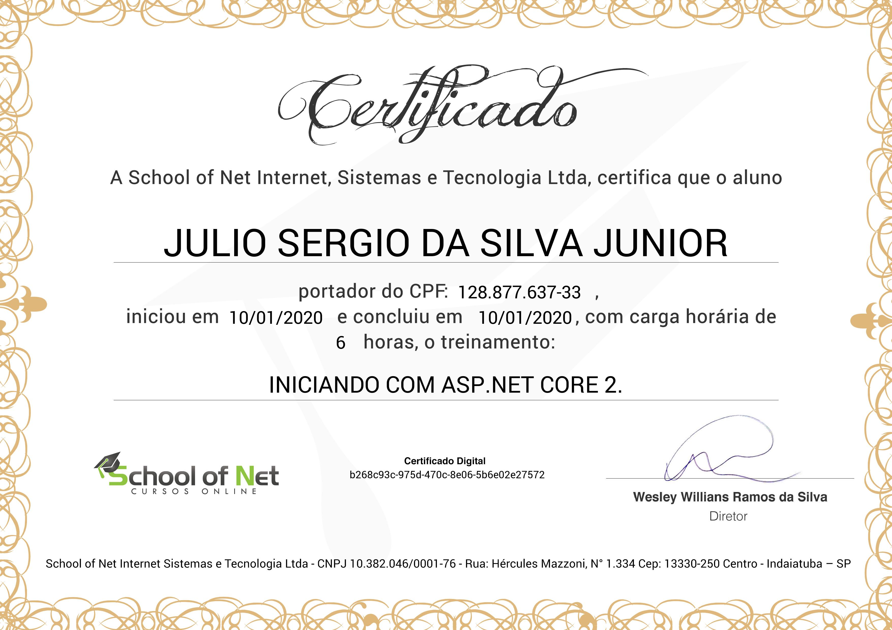

# Iniciando com ASP.NET Core
## [School of Net](https://www.schoolofnet.com)

* ASP.NET Core

Instrutor: Victor Lima

"Iniciaremos nossos estudos em ASP.NET Core na versão 2(Nova plataforma de desenvolvimento web da Microsoft). Apresentaremos sua estrutura e pastas e o uso do MVC, criando uma pequena aplicação funcional."

